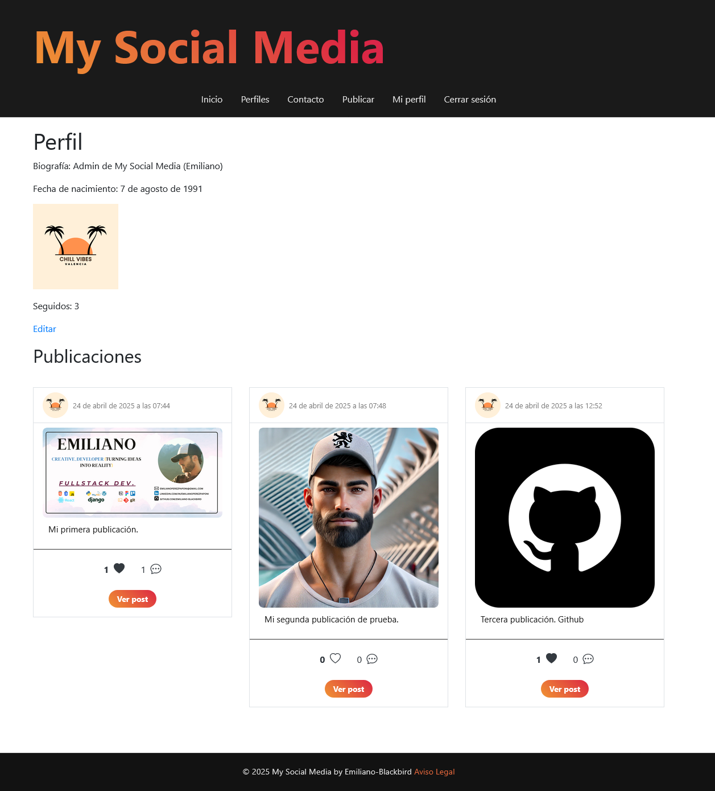

<!-- Banner -->

  

---

## My main projects (2025)

| Preview | Project & Repository | Technologies | Demo |
|--------|---------|--------------|------|
|  | [**Social media app**](https://github.com/Emiliano-Blackbird/My-social-media-project)        Instagram-style social network built. Features include user registration, login, posting, commenting, and profile management. |     | 🚫 No demo online, only Repository |
|  | [**Elearning Landing Page**](https://github.com/Emiliano-Blackbird/elearning-landing-page-responsive)        A fully responsive website built using a mobile-first approach, modern Sass (@use/@forward). |      | [🌠Live Demo](https://emiliano-blackbird.github.io/elearning-landing-page-responsive/) |
|  | [**E-Commerce WordPress**](https://github.com/Emiliano-Blackbird/Wordpress-Page-Blackbird-Sports)        Fictional online store offering quality gear, apparel, and accessories for an active lifestyle. Clean design and smooth shopping experience. |    | [🌠Live Demo](https://mediumpurple-locust-947874.hostingersite.com/) |
|  | [**Streamlit & MySQL projects**](https://github.com/Emiliano-Blackbird/Plantilla-Django-Terminada)        Collection of projects made with Python, SQL, and Streamlit to demonstrate skills. |    | 🚫 No demo online, only Repository |
|  | [**Portfolio Page**](https://github.com/Emiliano-Blackbird/Page-portfolio-project)        A personal webpage designed to showcase projects, skills, and contact information in a clean and user-friendly layout. Features a responsive design with a clear section structure focused on enhancing user experience. |     | [🌠Live Demo](https://emiliano-blackbird.github.io/Page-portfolio-project/) |
|  | [**Modern Art Gallery - Web**](https://github.com/Emiliano-Blackbird/Modern-art-gallery)        "A visually stunning web project designed for seamless performance across tablets, phones, and desktops. Experience an abstract aesthetic that adapts beautifully to any screen, merging sleek design with responsive functionality.". |     | [🌠Live Demo](https://emiliano-blackbird.github.io/Modern-art-gallery/) |
|  | [**Mini Projects With HTML - CSS - JavaScript**](https://github.com/Emiliano-Blackbird/Plantillas-HTML-CSS-JS)        A collection of useful mini projects and components to integrate into larger applications. |     | 🚫 No demo online, only Repository |
|  | [**My Personal Arduino Projects**](https://github.com/Emiliano-Blackbird/arduino_projects_by_emiliano_blackbird)        A collection of my personal Arduino Projects with software (in C++) and hardware. |  | 🚫 No demo online, only Repository |

## 👨‍💻 Author

    Emiliano Perez Paponi
    Full Stack Developer
    GitHub: @Emiliano-Blackbird
    Mail: EmilianoPerezPaponi@gmail.com
